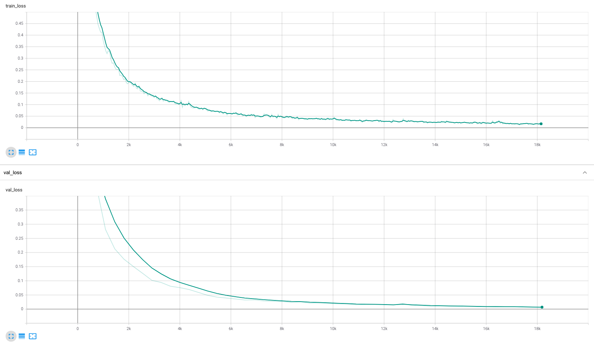

# Seq2Seq - Polynomial Expansion
This repo contains an implementation of a seq2seq [transformer](https://arxiv.org/abs/1706.03762) using PyTorch Lightning. The implementation is heavily borrowed from [bentrevett/pytorch-seq2seq](https://github.com/bentrevett/pytorch-seq2seq/blob/master/6%20-%20Attention%20is%20All%20You%20Need.ipynb), with a few key differences:
- This repo tests the model against a toy dataset of polynomial expansions (see `expand.md` or `The Problem` section below), rather than english to german translation
- Instead of using `torchtext`, I've implemented my own in-house text to tensor processing
- The model `Seq2Seq` top layer module is implemented using PyTorch Lightning
- I've added batch prediction, which speeds up prediction by orders of magnitudes

I'm hoping to add an example notebook of how to use the repo for english to german translation.

## The Problem
Implement a deep learning model that learns to expand single variable polynomials, where the model takes the factorized sequence as input and predict the expanded sequence. For example:

* `n*(n-11)=n**2-11*n`
* `n*(n-11)` is the factorized input
* `n**2-11*n`  is the expanded target

The expanded expressions are commutable, but only the form provided is considered correct. Here are some additional examples:

```
(c-17)*(5*c-26)=5*c**2-111*c+442
(5-2*t)*(-6*t-26)=12*t**2+22*t-130
-3*x**2=-3*x**2
(3*sin(x)-3)*(5*sin(x)+6)=15*sin(x)**2+3*sin(x)-18
-4*t*(8*t-14)=-32*t**2+56*t
(y+22)*(2*y-32)=2*y**2+12*y-704
(-5*s-20)*(s-15)=-5*s**2+55*s+300
(15-4*y)*(7*y+27)=-28*y**2-3*y+405
28*y**2=28*y**2
k*(8*k+23)=8*k**2+23*k
```

The full dataset (`data/data.txt`) contains a million examples.

## Reproduce
Split data into train and test set (use `--help` for more options):
```shell
python data.py
```

Train the model (use `--help` for more options):
```shell
python train.py \
    "models/best" \
    --gpus 1 \
    --gradient_clip_val 1 \
    --max_epochs 10 \
    --val_check_interval 0.2
```

Evaluate model on test set (use `--help` for more options):
```shell
python evaluate.py models/best
```

Run unit tests:
```shell
python -m unittest tests.py
```

## Model Accuracy
The model is evaluated against a **strict string equality** between the predicted target sequence and the groud truth target sequence. The model achieved an accuracy of `0.915`.



Here are some example translations:
```
--- example 1 ---
factored:   3*n*(-3*n-32)
expanded:   -9*n**2-96*n
prediction: -9*n**2-96*n
equal:      True

--- example 2 ---
factored:   (-k-32)*(5*k-28)
expanded:   -5*k**2-132*k+896
prediction: -5*k**2-132*k+896
equal:      True

--- example 3 ---
factored:   (-3*n-19)*(2*n-29)
expanded:   -6*n**2+49*n+551
prediction: -6*n**2+49*n+551
equal:      True

--- example 4 ---
factored:   (-4*i-22)*(3*i-31)
expanded:   -12*i**2+58*i+682
prediction: -12*i**2+58*i+682
equal:      True

--- example 5 ---
factored:   2*n**2
expanded:   2*n**2
prediction: 2*n**2
equal:      True

--- example 6 ---
factored:   (t-24)*(8*t+15)
expanded:   8*t**2-177*t-360
prediction: 8*t**2-177*t-360
equal:      True

--- example 7 ---
factored:   (y-24)*(7*y-27)
expanded:   7*y**2-195*y+648
prediction: 7*y**2-195*y+648
equal:      True

--- example 8 ---
factored:   5*s*(24-3*s)
expanded:   -15*s**2+120*s
prediction: -15*s**2+120*s
equal:      True

--- example 9 ---
factored:   3*x*(x-29)
expanded:   3*x**2-87*x
prediction: 3*x**2-87*x
equal:      True

--- example 10 ---
factored:   7*s*(-7*s-8)
expanded:   -49*s**2-56*s
prediction: -49*s**2-56*s
equal:      True

...

--- example 12 ---
factored:   (-6*n-9)*(-4*n-7)
expanded:   24*n**2+78*n+63
prediction: 24*n**2+70*n+63
equal:      False

...

--- example 44 ---
factored:   (25-6*z)*(z+11)
expanded:   -6*z**2-41*z+275
prediction: -6*z**2-31*z+275
equal:      False

...

--- example 69 ---
factored:   (-3*x-23)*(3*x-22)
expanded:   -9*x**2-3*x+506
prediction: -9*x**2-13*x+506
equal:      False

...

--- example 93 ---
factored:   (2*k+9)*(7*k-12)
expanded:   14*k**2+39*k-108
prediction: 14*k**2+49*k-108
equal:      False
```
